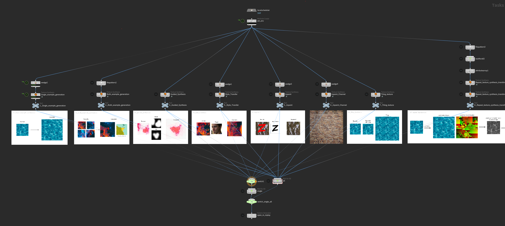
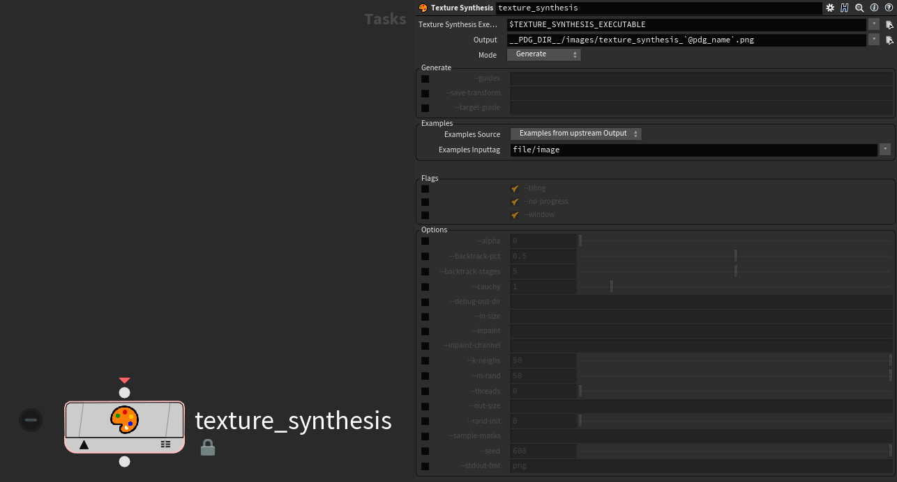

# 🎨 texture-synthesis-houdini

Houdini / PDG plugin for EmbarkStudios' [texture-synthesis](https://github.com/EmbarkStudios/texture-synthesis).

It uses the CLI of the compiled executable and inherits all of its goodies.

- Single example generation
- Multi example generation
- Guided Synthesis
- Style Transfer
- Inpaint
- Inpaint Channel
- Tiling texture
- Repeat texture synthesis transform on a new image
- Combining texture synthesis 'verbs'

## Requirements
Houdini 18.5+

## Installation
1. Get texture-synthesis-houdini
Either clone this with submodules 
   - To include the **image examples** as well as the **rust source code** provided by Embark:
     - Either clone this repository with its submodules

        `git clone https://github.com/manuelkoester/texture-synthesis-houdini.git --recurse-submodules`

      - Or download the **Source Code** of the latest releases from [texture-synthesis-houdini](https://github.com/manuelkoester/texture-synthesis-houdini/releases) and [texture-synthesis](https://github.com/EmbarkStudios/texture-synthesis/releases). Unpack both contents to disk and place texture-synthesis inside texture-synthesis-houdini.

    - If both are unneeded you can simply download this repository and unpack the contents to a preferred path on your system.

1. Get texture-synthesis executable

   - Go to the [releases page of texture-synthesis](https://github.com/EmbarkStudios/texture-synthesis/releases) and download the latest release for your system
   - Extract the executable file to the bin folder of texture-synthesis-houdini.

2. Add texture-synthesis-houdini to your Houdini Environment

   - Create a folder called **packages** in your Houdini preferences folder (in your home dir)
   - Copy the [**texture-synthesis-houdini.json**](https://github.com/fatboYY/texture-synthesis-houdini/blob/main/texture-synthesis-houdini.json) file into the **packages** folder
   - Edit the json file to point to the extracted **texture_synthesis_houdini** folder (edit the path in the "texture_synthesis_houdini" line)

To read more on configuration, see the [documentation on Packages](https://www.sidefx.com/docs/houdini/ref/plugins.html) on the official SideFX help.

## Getting Started

I reccommend taking a look at the example hipfile I've included at [texture_synthesis_houdini/hip/texture-synthesis_examples_01.hip](https://github.com/fatboYY/texture-synthesis-houdini/blob/main/texture-synthesis_examples_01.hip).  
Make sure you either cloned the repository with its submodules (see Installation step 1) or additionally downloaded and extracted the texture-synthesis source into texture-synthesis-houdini.

