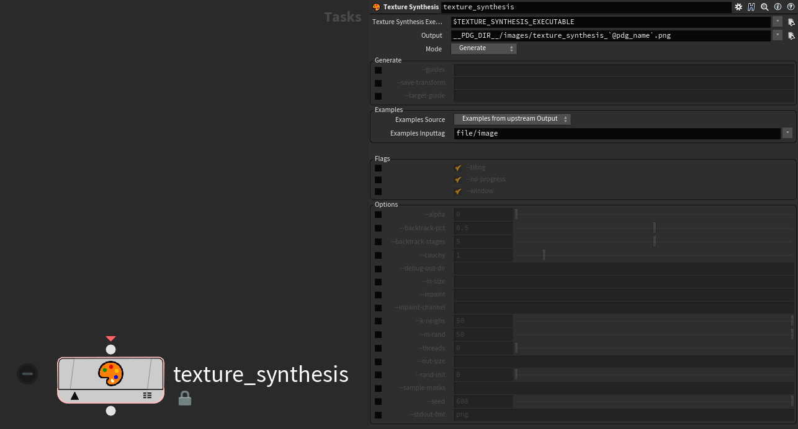
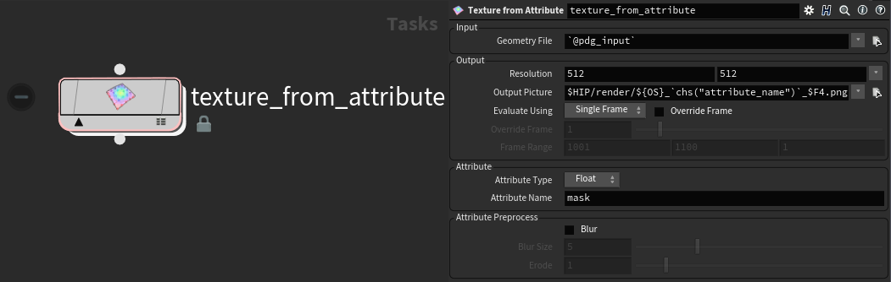
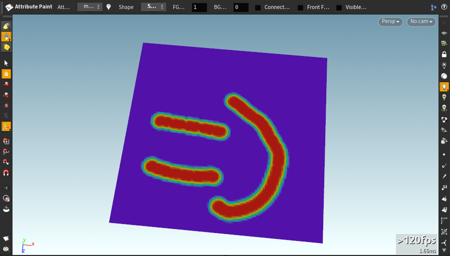
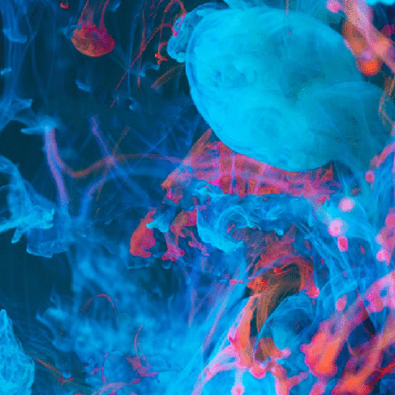
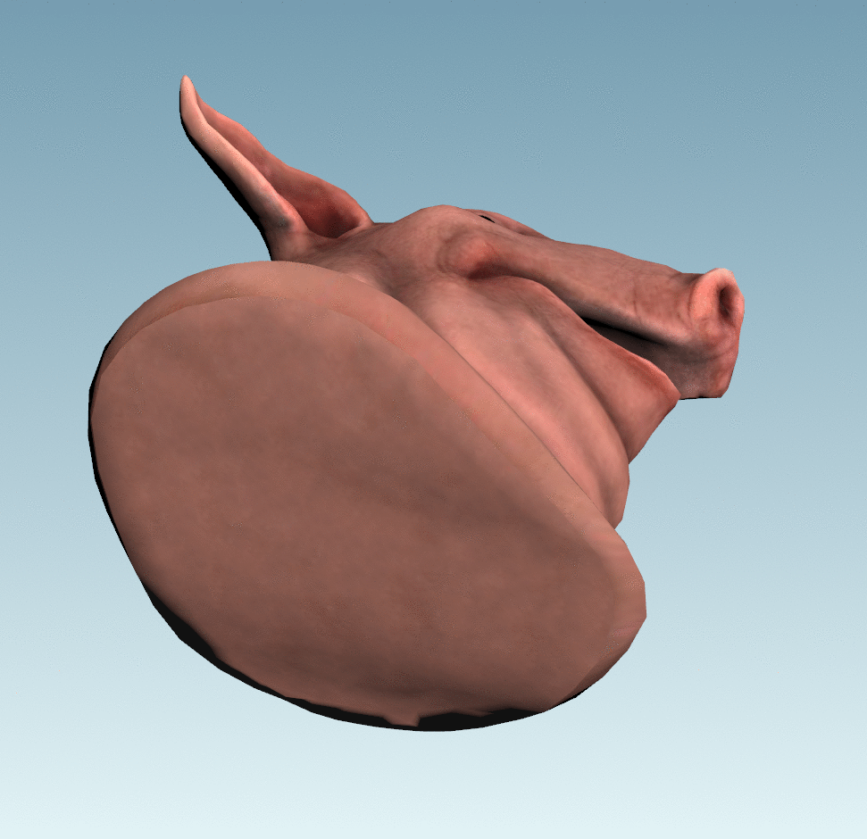
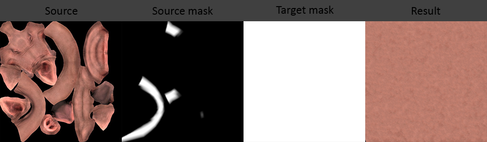
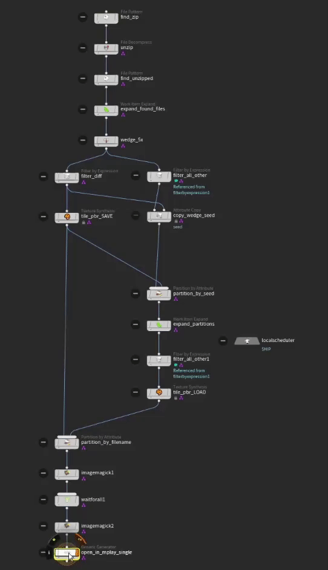

# 🎨 texture-synthesis-houdini

Houdini / PDG plugin for EmbarkStudios' [texture-synthesis](https://github.com/EmbarkStudios/texture-synthesis).

Blog Post that goes into more depth can be found on my [website](https://shadesoforange.de/texture-synthesis-houdini/).

## Features
### **texture-synthesis features** 

- Single example generation
- Multi example generation
- Guided Synthesis
- Style Transfer
- Inpaint
- Inpaint Channel
- Tiling texture
- Repeat texture synthesis transform on a new image
- Combining texture synthesis 'verbs'

### **attribute-from-example.hda**
texture-synthesis-houdini provides you with an otl to export point attributes as texture. This makes it really easy to use attributes as masks within texture-synthesis.

## Requirements
Houdini 18.5+ (18.5.462+ recommended)

## Installation
1. Get texture-synthesis-houdini including texture-synthesis with its executable
   - Recommended: Download the latest [release](https://github.com/manuelkoester/texture-synthesis-houdini/releases)
   
   - **Or** download and assemble
      

      
Expand

      <ul>
      <li> The source code: </li>
         <ul>
         <li> clone this repository including the texture-synthesis submodule  </li>
         <code>git clone https://github.com/manuelkoester/texture-synthesis-houdini.git --recurse-submodules</code>
         <li> <b>OR</b> download the <c>Source Code</c> of the latest releases from <a href="https://github.com/manuelkoester/texture-synthesis-houdini/releases">texture-synthesis-houdini</a> and <a href="https://github.com/EmbarkStudios/texture-synthesis/releases">texture-synthesis</a>. Unpack both contents to disk and place texture-synthesis inside texture-synthesis-houdini.</li></ul>
         <li>And the exectuable:</li>
         <ul>
         <li>Go to the <a href="https://github.com/EmbarkStudios/texture-synthesis/releases">releases page of texture-synthesis</a> and download the latest release for your system
         </li>
         <li>Create a bin folder inside texture-synthesis</li>
         <li>Extract the executable file to the bin folder of texture-synthesis.
         </li>
         </ul>

2. Add texture-synthesis-houdini to your Houdini Environment

   - Create a folder called **packages** in your Houdini preferences folder (in your home dir)
   - Copy the [**texture-synthesis-houdini.json**](https://github.com/fatboYY/texture-synthesis-houdini/blob/main/texture-synthesis-houdini.json) file into the **packages** folder
   - Edit the json file to point to the extracted **texture_synthesis_houdini** folder (edit the path in the "texture_synthesis_houdini" line)
   - Optional: If you have the texture-synthesis executable in a different place, you can point the **texture_synthesis_executable** to the path of that executable.

To read more on configuration, see the [documentation on Packages](https://www.sidefx.com/docs/houdini/ref/plugins.html) on the official SideFX help.

## Getting Started

I reccommend taking a look at the example hipfiles I've included at [texture_synthesis_houdini/hip](https://github.com/manuelkoester/texture-synthesis-houdini/tree/master/hip).

Make sure you either cloned the repository with its submodules (see Installation step 1) or additionally downloaded and extracted the texture-synthesis source into texture-synthesis-houdini.

Prior PDG knowledge is recommended. 

TIP: If you are cooking the `open_in_mplay` nodes and they won't stop cooking; it is usually because you have not closed mplay yet and Houdini thinks it's still executing the Work Item.

### **texture-synthesis_examples.hip**
This replicates all the exmples from the [texture-synthesis repository](ttps://github.com/EmbarkStudios/texture-synthesis).

To see test it yourself cook either the `open_in_mplay_single` or `open_in_mplay_all` node at `/obj/geo/topnet`. The `_single` version only cooks one feature, while the `_all` version cooks all features and previews them in mplay for you.

### **texture-synthesis_attribute_example.hip**
This showcases how you can use attributes on your geometry to drive your texture-synthesis operations.

It uses the painted attribute `mask` from the Attribute Paint node in the `texture_from_attribute` node within the TOP network.

To see test it yourself cook the `open_in_mplay` node for your OS at `/obj/geo/topnet`. Afterwards click on the different dots of the `texture_synthesis` which will load the differently seeded outputs on top of the grid. (See preview below)

### **texture-synthesis_pighead.hip**
Were you ever saddened as much as me that our beloved Pighead never got as much love as it should have gotten? The people at SideFX didn't even bother to give it a Texture for its "neck". Time to fix it the Houdini way!

We can generate a new UV set for its neck and start creating a fully procedural texture for it.
It uses a painted mask to sample "Pig-like" texture parts to generate a fully new texture from it.

To see test it yourself cook the `open_in_mplay` node for your OS at `/obj/geo/topnet`. Afterwards click on the different dots of the `texture_synthesis` which will load the differently seeded outputs into the `preview_new_texture` node and give our piggies' neck some new 🎨; the procedural way :)

### **texture-synthesis_tile_pbr.hip**
You can also easily tile PBR textures. It makes the diffuse map tileable and uses the transformations of the diffuse map to apply them to all other maps.

 
