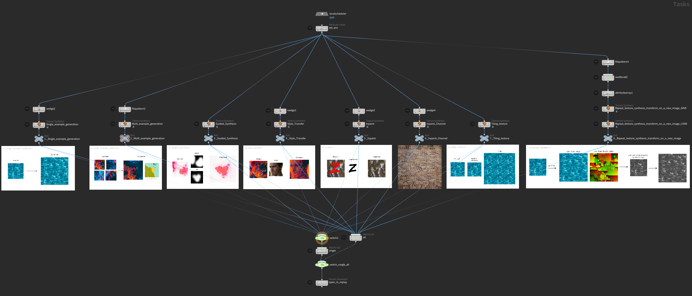
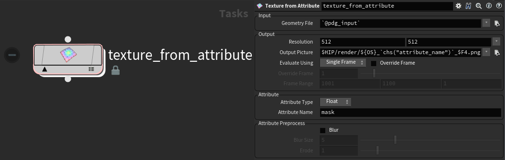

# 🎨 texture-synthesis-houdini

Houdini / PDG plugin for EmbarkStudios' [texture-synthesis](https://github.com/EmbarkStudios/texture-synthesis).

## Features
### **texture-synthesis features** 

- Single example generation
- Multi example generation
- Guided Synthesis
- Style Transfer
- Inpaint
- Inpaint Channel
- Tiling texture
- Repeat texture synthesis transform on a new image
- Combining texture synthesis 'verbs'

### **attribute-from-example.hda**
texture-synthesis-houdini provides you with an otl to export point attributes as texture. This makes it really easy to use attributes as masks within texture-synthesis.

## Requirements
Houdini 18.5+

## Installation
1. Get texture-synthesis-houdini including texture-synthesis with its executable
   - Recommended: Download the latest [release](https://github.com/manuelkoester/texture-synthesis-houdini/releases)
   
   - **Or** download and assemble
      

      
Expand

      <ul>
      <li> The source code: </li>
         <ul>
         <li> clone this repository including the texture-synthesis submodule  </li>
         <code>git clone https://github.com/manuelkoester/texture-synthesis-houdini.git --recurse-submodules</code>
         <li> <b>OR</b> download the <c>Source Code</c> of the latest releases from <a href="https://github.com/manuelkoester/texture-synthesis-houdini/releases">texture-synthesis-houdini</a> and <a href="https://github.com/EmbarkStudios/texture-synthesis/releases">texture-synthesis</a>. Unpack both contents to disk and place texture-synthesis inside texture-synthesis-houdini.</li></ul>
         <li>And the exectuable:</li>
         <ul>
         <li>Go to the <a href="https://github.com/EmbarkStudios/texture-synthesis/releases">releases page of texture-synthesis</a> and download the latest release for your system
         </li>
         <li>Create a bin folder inside texture-synthesis</li>
         <li>Extract the executable file to the bin folder of texture-synthesis.
         </li>
         </ul>

2. Add texture-synthesis-houdini to your Houdini Environment

   - Create a folder called **packages** in your Houdini preferences folder (in your home dir)
   - Copy the [**texture-synthesis-houdini.json**](https://github.com/fatboYY/texture-synthesis-houdini/blob/main/texture-synthesis-houdini.json) file into the **packages** folder
   - Edit the json file to point to the extracted **texture_synthesis_houdini** folder (edit the path in the "texture_synthesis_houdini" line)
   - Optional: If you have the texture-synthesis executable in a different place, you can point the **texture_synthesis_executable** to the path of that executable.

To read more on configuration, see the [documentation on Packages](https://www.sidefx.com/docs/houdini/ref/plugins.html) on the official SideFX help.

## Getting Started

I reccommend taking a look at the example hipfiles I've included at [texture_synthesis_houdini/hip](https://github.com/manuelkoester/texture-synthesis-houdini/tree/master/hip).

Make sure you either cloned the repository with its submodules (see Installation step 1) or additionally downloaded and extracted the texture-synthesis source into texture-synthesis-houdini.

### **texture-synthesis_examples.hip**
This replicates all the exmples from the [texture-synthesis repository](ttps://github.com/EmbarkStudios/texture-synthesis).

### **texture-synthesis_attribute_example.hip**
This showcases how you can use attributes on your geometry to drive your texture-synthesis operations.

